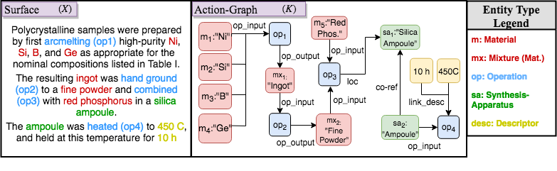
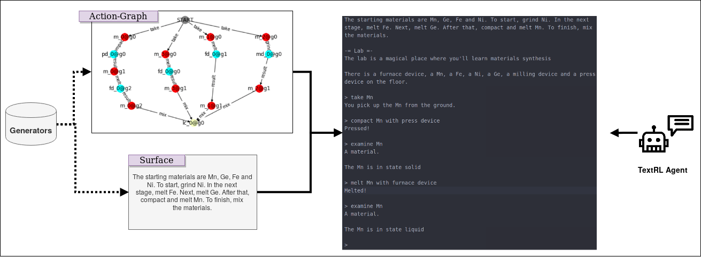

# TextLabs
Adaptation of the [TextWorld](https://github.com/Microsoft/TextWorld) text-based reinforcement learning (RL) environment for [materials synthesis procedures analysis](https://www.synthesisproject.org/). This is intended to become a proof-of-concept for "Text-To-Quest", a new approach to procedural text understanding, by which free natural language instructions or narratives are interpreted as a game, whose solution by a text-based agent is equivalent to the successful extraction of the procedure in the required structured form.

More formally, the objective is the extraction of an *action graph* $K$ from an unstructured natural language *surface text* $X$.

An example from our materials science domain:


We approach this from a reinforcement learning perspective, where an agent will be trained on increasingly harder generated texts simulating materials synthesis procedures (attempting to approach something like $X$ above). Each text is interpreted as instructions for solving a game (generated alongside the text), and reward is obtained by successfully following the instructions in the game context. The winning policy (sequence of actions) carried out by the agent for a specific instruction set is exactly the desired action graph $K$.



For a detailed system overview, refer to our paper, [_Playing by the Book: An Interactive Game Approach for Action Graph Extraction from Text_](https://arxiv.org/abs/1811.04319).

This repository is essentially a fork of TextWorld ([version 1.0.0](https://github.com/Microsoft/TextWorld/tree/1.0.0/tw_textlabs)) with the following main modifications:

 - Incorporation of domain specific "lab" entities and logic in the TextWorld knowledge base.
  - A `QuestGenerator` for generating materials synthesis "quests" consistent with the domain-specific logic. This is similar in function (and utilizes) the existing `Chainer` helper class.
 - Surface Generator for generating the quest instructions for the generated quests. This replaces the TextWorld `Grammar`.
 -  A new "lab challenge".

Note that the implementations are still preliminary and are under active development!

We call our extension package `tw_textlabs` to avoid confusion with the original `textworld` package.

Following are the Textworld installation and usage instructions, which we follow with minor modifications.

## Installation

TextWorld requires __Python 3__ and only supports __Linux__ and __macOS__ systems at the moment. We have only tested TextLabs in __Linux__ environments.

### Requirements

TextWorld requires some system libraries for its native components.
On a Debian/Ubuntu-based system, these can be installed with

    sudo apt install build-essential uuid-dev libffi-dev python3-dev curl git

And on macOS, with

    brew install libffi curl git

### Installing TextWorld

The easiest way to install TextWorld is via [`pip`](https://pypi.org/).

After cloning the repo, go inside the root folder of the project (i.e. alongside `setup.py`) and run

    pip install .

### Extras

TextWorld's visualization options aren't yet supported for TextLabs.


## Usage

### Generating a game (command-line)

TextLabs text-based games can be generated via the `tw-make-lab` script. 

#### Challenge

    tw-make-lab challenge --seed 1234 --output gen_games/game_1234.ulx --challenge tw-lab_game-level12

`challenge` indicates we want to create a random game, where `--challenge` specifies the type of challenge and difficulty level. Under this mode, text generation flags are currently set automatically.

In both modes, `--max_search_steps` sets the number of steps for the search for a valid quest satisfying the constraints. Note that a valid quest may not be found within `max_search_steps`, especially for higher levels.

### Generating a game (notebook)

Alternatively, games can be hand-crafted in a Jupyter Notebook environment. For details, see [example](notebooks/Demo-play-lab-game.ipynb).

### Playing a game (terminal)

To play a game, one can use the `tw-play` script. For instance, the command to play the game generated in the previous section would be

    tw-play gen_games/game_1234.ulx

> **Note:** Only Z-machine's games (*.z1 through *.z8) and Glulx's games (*.ulx) are supported.

### Playing a game (Python)

Here's how you can interact with a text-based game from within Python.

```python
import tw_textlabs

env = tw_textlabs.start("gen_games/game_1234.ulx")  # Start an existing game.
agent = tw_textlabs.agents.NaiveAgent()  # Or your own `tw_textlabs.Agent` subclass.

# Collect some statistics: nb_steps, final reward.
avg_moves, avg_scores = [], []
N = 10
for no_episode in range(N):
    agent.reset(env)  # Tell the agent a new episode is starting.
    game_state = env.reset()  # Start new episode.

    reward = 0
    done = False
    for no_step in range(100):
        command = agent.act(game_state, reward, done)
        game_state, reward, done = env.step(command)

        if done:
            break

    # See https://textworld-docs.maluuba.com/textworld.html#textworld.core.GameState
    avg_moves.append(game_state.nb_moves)
    avg_scores.append(game_state.score)

env.close()
print("avg. steps: {:5.1f}; avg. score: {:4.1f} / 1.".format(sum(avg_moves)/N, sum(avg_scores)/N))
```

## Citing TextLabs
If you use TextLabs, please cite the following BibTex:
```
XXX
```

## Contributing

This project welcomes contributions and suggestions.

## Todos
- [ ] Add SynthesisApparatus entities to generated quests
- [ ] More complex surface texts.
- [ ] Add component to convert annotated action graphs to TextLabs format.
